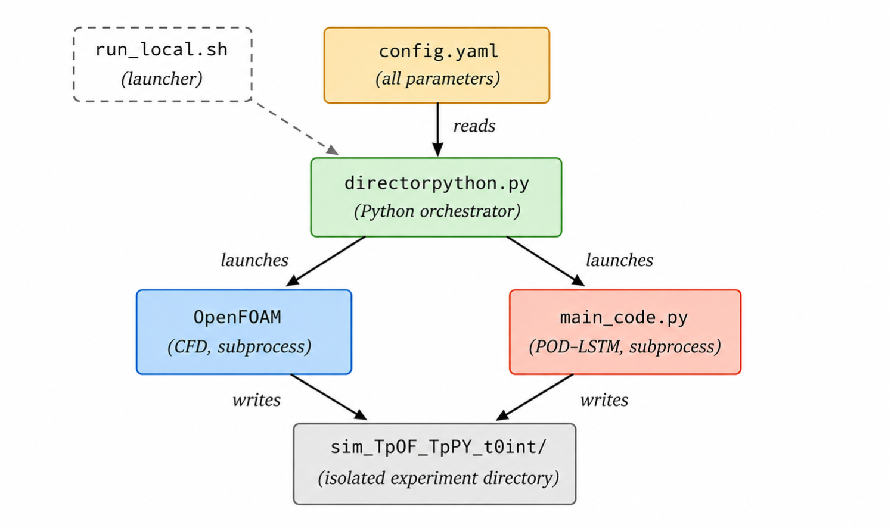
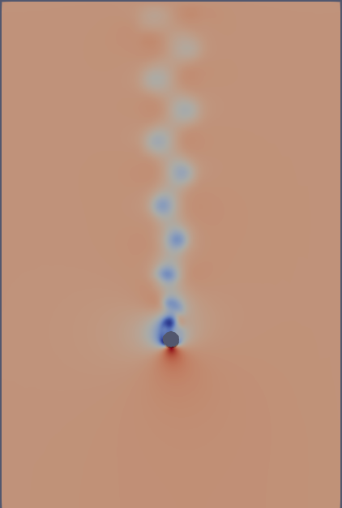
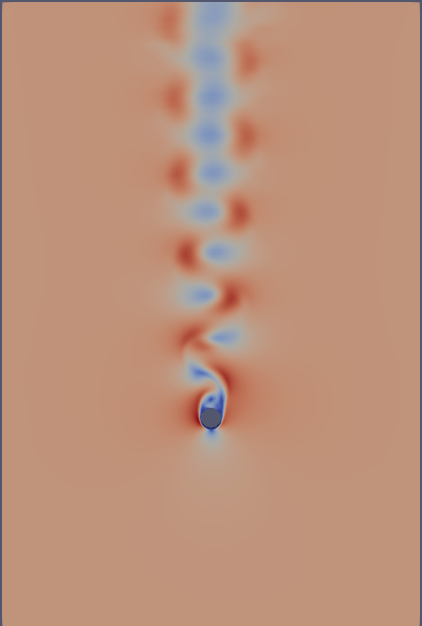
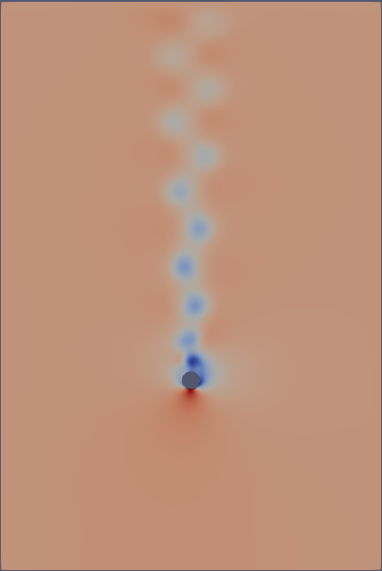
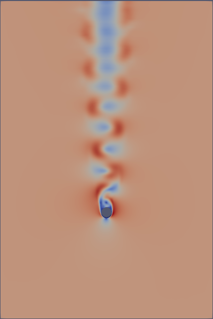
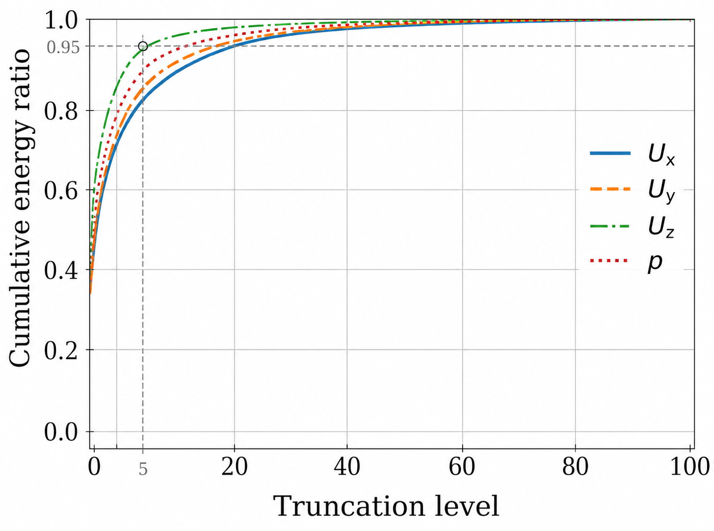

# Adaptive CFD–POD–LSTM Pipeline
### Validation on Canonical Cylinder Flow

## Abstract

This work develops and validates a generalized adaptive pipeline that couples the OpenFOAM CFD solver with a data-driven surrogate model (POD + LSTM) in a closed loop. The pipeline is first verified on the canonical flow around a circular cylinder at Re = 300 — a benchmark that has been used extensively in the ROM literature —.

---

## 1. Motivation

High-fidelity CFD simulations solve the incompressible Navier–Stokes equations over fine spatial meshes and at small time steps, yielding accurate flow fields at the cost of significant computational resources. Tasks that require many flow evaluations — parameter studies, sensitivity analyses, real-time forecasting — quickly become infeasible if every evaluation must be covered by the full solver.

**Purely offline surrogate models** (trained once on a snapshot database and then used for prediction) accumulate autoregressive error and diverge over long prediction horizons. The adaptive prediction paradigm solves this by periodically restarting the CFD solver, regenerating ground-truth snapshots, and retraining the model from scratch using transfer learning. This way, prediction accuracy remains controlled indefinitely.

---

## 2. Methodology

### 2.1 The adaptive loop

The pipeline alternates between two computational phases:

```
 CFD block           ML block            CFD block           ML block
[T₀ ───── T₁]    [T₁ ───── T₂]    [T₂-δt ─── T₃]    [T₃ ───── T₄]
                                      └── warm restart
```

| Step | What happens |
|------|-------------|
| **1. CFD phase** | OpenFOAM runs for `TIME_PERIOD_OF` seconds, saving a snapshot every `TIME_STEP_WRITE_OF` seconds → K snapshots |
| **2. POD compression** | Truncated SVD of the snapshot matrix $\mathbf{X} \in \mathbb{R}^{C N_x \times K}$ retains the $r_0$ most energetic spatial modes |
| **3. LSTM training** | The network is trained (or fine-tuned via transfer learning from the previous checkpoint) on the $r_0$ temporal coefficient series |
| **4. Prediction** | Auto-regressive loop produces $K_{\text{pred}}$ future coefficient vectors; full fields reconstructed as $\hat{\mathbf{X}} \approx \mathbf{U}_{r_0} \boldsymbol{\Sigma}_{r_0} \hat{\mathbf{C}}$ |
| **5. Warm restart** | OpenFOAM restarts from T₂ − TIME_AHEAD (a small overlap), ensuring the next CFD block begins from a physically coherent state |


### 2.2 Dimensionality reduction: truncated SVD

Given the snapshot matrix $\mathbf{X} \in \mathbb{R}^{C N_x \times K}$:

$$\mathbf{X} = \mathbf{U}\boldsymbol{\Sigma}\mathbf{V}^\top \approx \mathbf{U}_{r_0}\boldsymbol{\Sigma}_{r_0}\mathbf{V}_{r_0}^\top$$

The temporal coefficients $\mathbf{C} = \mathbf{V}_{r_0}^T \in \mathbb{R}^{r_0 \times K}$ encode how each spatial mode contributes at each time step. By the Eckart–Young theorem, the truncated SVD is the optimal rank-$r_0$ approximation in both the Frobenius and spectral norms. For the cylinder flow at Re = 300, the Kármán vortex street is dominated by a single periodic spatial structure: **5 modes capture over 90% of the fluctuating energy**.

### 2.3 Temporal prediction: LSTM

The LSTM ingests a sliding window of `INP_SEQ` past coefficient vectors and predicts the next one:

```
Input:  c(t-L+1), c(t-L+2), …, c(t)     ← L = INP_SEQ past steps
Output: ĉ(t+1)                          ← 1 step ahead
```

Predictions are fed back as inputs and the window slides forward, generating an auto-regressive chain of arbitrary length. At the end of each adaptive iteration, the model weights are saved as a checkpoint: the next training phase loads these weights and fine-tunes them on fresh data — **transfer learning** — instead of starting from random initialisation.

| Hyperparameter | Value | Description |
|---|---|---|
| `HIDDEN_SIZE` | 128 | LSTM hidden state dimension |
| `NUM_LAYERS` | 1 | Stacked LSTM layers |
| `INP_SEQ` | 8 | Sliding window length (time steps) |
| `EPOCHS` | 1000 | Maximum training epochs |
| `LOSS_THRESHOLD` | $1 \times 10^{-8}$ | Early stopping criterion (MSE) |
| `OPTIMIZER` | Adam | lr = $10^{-3}$, weight_decay = $10^{-4}$ |

### 2.4 Pipeline architecture

The orchestration layer was fully refactored from the reference implementation, resolving five limitations that tied the original code to a single test case:

| Limitation | Solution |
|---|---|
| L1 — Parameters scattered across `.sh` and `.py` files | Single `config.yaml` with all parameters |
| L2 — `sed -i` text substitution of OpenFOAM dictionaries | `foamDictionary` (native OF tool, validates syntax) |
| L3 — No experiment isolation | Auto-named directory `sim_TpOF_TpPY_t0/` per run |
| L4 — Missing fields on solver restart | `copy_missing_fields` + `fill_missing_fields` functions |
| L5 — No offline-only mode | `SOLO_PYTHON: true` flag in `config.yaml` |

The result is a single Python orchestrator (`directorpython.py`) that reads `config.yaml` and drives the entire CFD–SVD–LSTM cycle. **Changing the test case requires only editing `config.yaml`.**



---

## 3. Canonical Cylinder Case

### 3.1 Case description

The benchmark geometry is an incompressible three-dimensional flow around a circular cylinder of diameter D placed inside a rectangular channel. This case is a standard reference in the computational fluid dynamics literature: at moderate Reynolds numbers, the cylinder wake develops the alternating vortex shedding known as the **Kármán vortex street** — a periodic, spatially coherent structure that can be represented with very few POD modes, making it the ideal first test for a POD + LSTM surrogate.

| Parameter | Value |
|---|---|
| Reynolds number | Re = 300 (laminar, no turbulence model) |
| Solver | OpenFOAM `foamRun` with `incompressibleFluid` module |
| Pressure–velocity coupling | PISO algorithm |
| Mesh | ~10⁴ cells (structured, boundary-layer refinement around cylinder) |
| Inlet BC | Uniform velocity |
| Outlet BC | Zero pressure gradient |
| Walls | No-slip |

### 3.2 Temporal parameters

The simulation uses an adaptive time step (`adjustTimeStep yes`, `maxCo = 0.5`) to keep the Courant number below 0.5 throughout the domain. Snapshots are written at fixed physical intervals.

| Parameter | Value | Description |
|---|---|---|
| `endTime` | 100 s | Physical end time of the reference CFD run |
| `maxDeltaT` | 1 s | Maximum allowed time step |
| `writeInterval` | 1 s | Snapshot saving interval |
| `INITIAL_TIME` | 100 s | Start of the adaptive loop (flow in periodic regime) |
| `TIME_PERIOD_OF` | 100 s | Duration of each CFD block |
| `TIME_PERIOD_PY` | 100 s | Duration of each ML prediction block |
| `TIME_AHEAD` (δt) | 5 s | Warm-restart overlap |
| `NUM_ITERATIONS` | 2 | Number of CFD → ML cycles |

The adaptive loop is initialised at t = 100 s, the instant at which the Kármán vortex shedding has reached its statistically periodic regime. The experiment is stored in the isolated directory `sim_100_100_100/`.

### 3.3 Physical picture

The Kármán vortex street is clearly visible in both the pressure and velocity fields. At t ≈ 100 s the wake already shows the characteristic lateral modulation; at t ≈ 200 s (end of the first CFD block) the alternating high- and low-velocity structures extend several diameters downstream. Low-pressure regions (blue) alternate on either flank of the cylinder as vortices are shed and convected.

This periodicity — and the compactness of its POD representation — is what makes the cylinder the canonical benchmark for the adaptive framework: **5 modes suffice to capture over 90% of the fluctuating kinetic energy**, so the LSTM operates on a 5-dimensional coefficient space.

<div align="center">
<table>
<tr>
  <th align="center">Pressure <i>p</i> — t ≈ 100 s</th>
  <th align="center">Velocity |<b>U</b>| — t ≈ 100 s</th>
</tr>
<tr>
  <td align="center"></td>
  <td align="center"></td>
</tr>
<tr>
  <th align="center">Pressure <i>p</i> — t ≈ 200 s</th>
  <th align="center">Velocity |<b>U</b>| — t ≈ 200 s</th>
</tr>
<tr>
  <td align="center"></td>
  <td align="center"></td>
</tr>
</table>

</div>
<p align="center"><em>Pressure fields <i>p</i> (left) and velocity modulus |<b>U</b>| (right) at the beginning (t ≈ 100 s, established periodic regime) and at the end of the first CFD block (t ≈ 200 s). The Kármán vortex street is clearly visible in both variables.</em></p>

---

## 4. Results

### 4.1 Successful end-to-end execution

The pipeline completed both adaptive iterations without errors, producing the isolated experiment directory `sim_100_100_100/` with CFD time folders and ML predictions correctly separated. The execution confirmed the correct functioning of all five architectural improvements:

- `config.yaml` was read and all parameters were passed coherently to both OpenFOAM and the Python module.
- `foamDictionary` modified `system/controlDict` robustly at each iteration without syntax errors.
- The isolated experiment directory was created and populated correctly.
- Missing OpenFOAM fields (`phi`, internal time-step registers) were copied to the restart directory before each new CFD phase, preventing fatal errors on solver start.
- The `SOLO_PYTHON` mode allowed rerunning the ML module on existing snapshots without relaunching any simulation.

### 4.2 POD energy spectrum

The cumulative energy curve $\varepsilon(r_0)$ for the cylinder exhibits an elbow at $r_0 = 5$, as it is shown in the following picture:

 

<div align="center">

| Modes $r_0$ | Cumulative energy $\varepsilon(r_0)$ |
|---|---|
| 1 | ~75% |
| 2 | ~88% |
| 5 | **>90%** |
| 10 | ~99% |

</div>

This fast growth of the cummulative energy ratio — a hallmark of flows dominated by a single coherent structure — confirms that the LSTM needs to predict only a handful of coefficients to reconstruct the full three-dimensional field with high fidelity.

### 4.3 Key validation outcomes

> **The transition from the Zou (2025) reference implementation to the generalised pipeline required zero changes to the prediction module (`main_code.py`). Only `config.yaml` was edited.** This confirms that the separation between the orchestration layer and the mathematical prediction layer produces a geometry-agnostic pipeline.

| Verification objective | Outcome |
|---|---|
| Correct `config.yaml` parsing | **PASS** — all 7 parameter blocks read without errors |
| `foamDictionary` field editing | **PASS** — `controlDict` updated correctly in both iterations |
| Experiment directory isolation | **PASS** — `sim_100_100_100/` created and self-contained |
| Missing-fields management | **PASS** — `phi` and internal registers copied before each restart |
| `SOLO_PYTHON` mode | **PASS** — ML module ran on existing snapshots without launching OF |
| Warm-restart continuity | **PASS** — iteration 2 started from t = 295 s (CFD-verified state) |
| End message | **PASS** — `"All iterations completed successfully!"` |

---

## 5. Conclusions

The canonical cylinder case at Re = 300 served as the verification benchmark for the generalised adaptive CFD–POD–LSTM pipeline. All five architectural improvements introduced over the Zou (2025) reference implementation were validated end-to-end. The pipeline:

- Reads a single `config.yaml` configuration file — no `.sh` or `.py` files need to be edited.
- Manages the full CFD–SVD–LSTM cycle through a single Python orchestrator (`directorpython.py`).
- Isolates each experiment in its own directory, enabling clean comparison of configurations.
- Handles OpenFOAM dictionary editing robustly via `foamDictionary`, regardless of file formatting.
- Copies missing internal fields before each solver restart, ensuring no fatal abort.
- Provides an offline prediction mode (`SOLO_PYTHON`) for hyperparameter tuning without re-running CFD.

For the cylinder at Re = 300, the Kármán vortex street is well captured by $r_0 = 5$ POD modes (> 90% energy). The LSTM, operating on this compact 5-dimensional coefficient space with a sliding window of $L = 8$ steps, reproduces the temporal dynamics through transfer learning across adaptive iterations.

---
