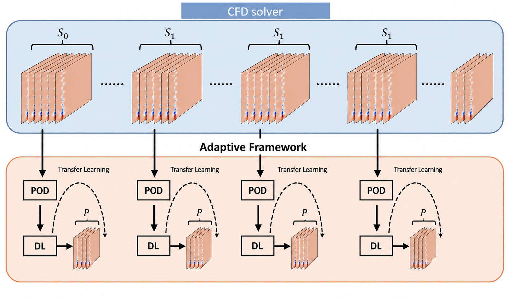

# Overview

This tutorial explains how to use the generalized **adaptive CFD–POD–LSTM pipeline** developed at ETSIAE–UPM. The pipeline couples an OpenFOAM CFD solver with a data-driven surrogate model (Proper Orthogonal Decomposition + Long Short-Term Memory network) in a closed loop. At each iteration, OpenFOAM generates a block of flow snapshots, the LSTM is trained on them and predicts the next block, and the solver restarts — keeping prediction accuracy controlled over arbitrarily long horizons.

The generalization introduced in this work replaces all scattered shell and Python configuration files from the original implementation (Zou 2025) with a single `config.yaml` file and a single Python orchestrator (`directorpython.py`), making the pipeline portable to any OpenFOAM case.

# What This Tutorial Covers

- What CFD adaptive prediction is and why it is needed.
- How the CFD–POD–LSTM loop works (adaptive framework).
- How POD via truncated SVD reduces the problem dimensionality.
- How the LSTM is trained and used for auto-regressive prediction.
- How to install the required Python environment.
- How to copy the pipeline into any OpenFOAM case.
- How to configure every parameter in `config.yaml`.
- How to run in offline mode (`SOLO_PYTHON=true`) on pre-computed snapshots.
- How to run the full adaptive loop (`SOLO_PYTHON=false`) with a live OpenFOAM simulation.
- How to read the output logs and visualise results in ParaView.

# Related Links

- Notebook: *(to be added)*
- Video: *(to be added)*
- Dataset: *(to be added)*
- Application hub: <https://modelflows.github.io/modelflowsapp/software/applications/2026-urban-flows/>

# Contributors
- Xiangrui Zou
- Carlos Sainz García
- Mikel Navarro Huarte

---

## Full Tutorial Content

### Table of Contents

1. [Introduction](#1-introduction)
2. [The adaptive framework](#2-the-adaptive-framework)
3. [Methodology: POD + LSTM](#3-methodology-pod--lstm)
4. [File structure](#4-file-structure)
5. [Environment setup](#5-environment-setup)
6. [config.yaml — all parameters](#6-configyaml--all-parameters)
7. [Run the pipeline](#7-run-the-pipeline)
8. [Summary / Checklist](#8-summary--checklist)

---

## 1. Introduction

### The challenge of high-fidelity simulations

Computational Fluid Dynamics (CFD) solvers — such as OpenFOAM — numerically solve the Navier–Stokes equations to predict how a fluid (air, water, etc.) moves through a geometry. To get accurate results, the solver must resolve all relevant spatial and temporal scales of the flow, which translates directly into very fine meshes and very small time steps.

This accuracy comes at a steep computational price:
- A single simulation of a realistic case can take hours or days on a cluster.
- Engineering tasks like parameter optimisation or uncertainty quantification require **thousands** of such evaluations.
- Running all of them with a full CFD solver is often completely infeasible.

### Why machine learning?

Data-driven surrogate models can learn the dynamics of a flow from a set of precomputed snapshots and then **predict** future states in a fraction of the time. The idea is to let the CFD solver run for a while, collect its output, train a neural network, and then let the network take over prediction — bypassing the expensive solver.

The key challenge is **prediction drift**: purely data-driven models are trained once and their accuracy degrades over time as the flow evolves and the model encounters conditions not seen during training.

### Adaptive prediction: the solution

Adaptive prediction solves the drift problem by coupling the ML model with the live CFD solver in a closed loop. Instead of training once and predicting forever, the pipeline alternates between:

1. **CFD solver** — generates new, accurate snapshots for a window of time.
2. **ML model (POD-DL)** — trains on those snapshots and predicts the next window.
3. **Repeat** — the solver restarts from near the end of the ML prediction, corrects any drift, and the cycle continues.

This way, accuracy remains controlled over arbitrarily long prediction horizons and the model stays robust to shifts in the flow regime.

> **The only file you need to edit is `config.yaml`. The only command you need to run is `python pyPseudo_Adaptive_parallel/directorpython.py`.**

---

## 2. The adaptive framework

### How the loop works

The pipeline alternates between blocks of CFD simulation and blocks of ML prediction:



At each iteration:

1. **OpenFOAM runs** from `T₀` to `T₁`, saving a snapshot of the flow field every `TIME_STEP_WRITE_OF` seconds.
2. **POD-DL reads** those snapshots, applies truncated SVD to reduce them to a low-dimensional representation, and trains an LSTM on the resulting temporal coefficients.
3. **LSTM predicts** the coefficients from `T₁` to `T₂` in an auto-regressive loop; the full flow field is reconstructed from those coefficients.
4. **OpenFOAM restarts** from `T₂ − TIME_AHEAD` (a small overlap ensures continuity between the CFD and ML blocks).
5. Steps 1–4 repeat `NUM_ITERATIONS` times.

### Key design choices

| Concept | What it means |
|---|---|
| `TIME_AHEAD` | A small temporal overlap (typically 5 snapshots × `dt`) so that OpenFOAM does not start from a discontinuity when it picks up after the ML block. |
| Transfer learning | The LSTM is not retrained from scratch every iteration. If a checkpoint exists from the previous round, the model is loaded and fine-tuned on the new data — each successive round trains faster. |
| `SOLO_PYTHON=true` | Skips OpenFOAM entirely. All snapshots must already exist in `CFD_DIR`. Useful for offline experiments, first validation, or debugging the ML module without running a full simulation. |

---

## 3. Methodology: POD + LSTM

### Why dimensionality reduction?

A typical CFD mesh has millions of cells and each field (velocity, pressure) is a vector at every cell. Feeding raw snapshots directly into a neural network would be computationally prohibitive. Proper Orthogonal Decomposition (POD) compresses the data: instead of predicting millions of numbers, the LSTM only needs to predict a handful of **temporal coefficients**.

### POD via truncated SVD

Given a snapshot matrix $\mathbf{X} \in \mathbb{R}^{N_{\text{cells}} \times K}$ where each column is one time snapshot:

$$
\mathbf{X} = \mathbf{U} \boldsymbol{\Sigma} \mathbf{V}^T \qquad \text{(full SVD)}
$$

$$
\mathbf{X}_r \approx \mathbf{U}_r \boldsymbol{\Sigma}_r \mathbf{V}_r^T \qquad \text{(truncated to } r_0 \text{ dominant modes)}
$$

$$
\mathbf{C} = \mathbf{V}_r^T \in \mathbb{R}^{r_0 \times K} \qquad \text{(temporal coefficients)}
$$

- $\mathbf{U}_r$ — spatial POD modes (basis vectors), shape: $N_{\text{cells}} \times r_0$
- $\boldsymbol{\Sigma}_r$ — singular values ($\sigma_i^2 \propto$ energy of mode $i$)
- $\mathbf{C}$ — temporal coefficients: how much each mode contributes at each time step

The reconstruction error is measured by the **RRMSE**:

$$
RRMSE = \frac{\left\| \mathbf{X} - \mathbf{U}_r \boldsymbol{\Sigma}_r \mathbf{V}_r^T \right\|_F}{\left\| \mathbf{X} \right\|_F}
$$

A good choice of `NUM_MODES` ($r_0$) keeps this below ~5 %.

### LSTM prediction

The LSTM receives the last `INP_SEQ` columns of $\mathbf{C}$ (a sliding window of $L$ past coefficient vectors) and predicts the next one:

$$
\mathbf{c}(t-L+1),\, \ldots,\, \mathbf{c}(t) \;\xrightarrow{\text{LSTM}}\; \mathbf{c}(t+1)
$$

This is repeated auto-regressively for `NUM_PREDS` steps. The full predicted field is then reconstructed as:

$$
\hat{\mathbf{X}}_{\text{pred}} \approx \mathbf{U}_r \boldsymbol{\Sigma}_r \hat{\mathbf{C}}
$$

### Training

- **Loss:** Mean Squared Error (MSE) between predicted and true temporal coefficients:

$$
\text{MSE} = \frac{1}{Npr} \sum_{n=1}^{N} \sum_{t=1}^{p} \sum_{k=1}^{r} \left(\hat{c}_{n,t,k} - c_{n,t,k}\right)^2 = \frac{1}{Npr} \sum_{n,t} \left\| \hat{\mathbf{c}}_{n,t} - \mathbf{c}_{n,t} \right\|_2^2
$$

- **Checkpoint:** if a model from the previous iteration exists, it is loaded and fine-tuned (transfer learning). If no checkpoint is found, training starts from scratch.
- **Early stopping:** training halts when loss drops below `LOSS_THRESHOLD`.

> **The two hyperparameters with the greatest impact on prediction quality are `NUM_MODES` ($r_0$) and `INP_SEQ` ($L$). Start with `NUM_MODES=5` and `INP_SEQ=8` and tune from there.**

### Divergence monitoring: CE and TE

To decide when to restart the CFD solver, the pipeline monitors two scalar error metrics at each predicted time step $t$:

**Consistency Estimate (CE)** — measures how far the LSTM prediction $\hat{\boldsymbol{u}}(t)$ has drifted from the POD-reconstructed reference $\boldsymbol{u}(t)$ computed on the latest CFD window:

$$
\text{CE}(t) = \frac{\left\| \hat{\boldsymbol{u}}(t) - \boldsymbol{u}(t) \right\|}{\left\| \boldsymbol{u}(t) \right\|}
$$

**Truncation Estimate (TE)** — measures the POD basis error: how much information is lost by retaining only $r_0$ modes from the current CFD snapshot set:

$$
\text{TE}(t) = \frac{\left\| \hat{\boldsymbol{u}}(t) - \boldsymbol{u}(t) \right\|}{\left\| \boldsymbol{u}(t) \right\|}
$$

The CFD solver is automatically invoked when either metric exceeds its threshold (`CE_THRESHOLD` or `TE_THRESHOLD` in `config.yaml`). In fixed-interval mode both thresholds are set to $10^9$ (disabled) and the solver restarts after a fixed number of predicted snapshots.

### Divergence monitoring: Mahalanobis distance and ensemble UQ

Two additional criteria are available for more sophisticated adaptive triggering.

**Mahalanobis distance** — measures how far a predicted coefficient vector $\hat{\mathbf{c}}_t$ departs from the training distribution. First, the mean and regularised covariance of the training coefficients $\{\mathbf{c}_t\}_{t=1}^{K}$ are computed:

$$
\boldsymbol{\mu} = \frac{1}{K} \sum_{t=1}^{K} \mathbf{c}_t
$$

$$
\mathbf{D} = \frac{1}{K-1} \sum_{t=1}^{K} \left(\mathbf{c}_t - \boldsymbol{\mu}\right)\left(\mathbf{c}_t - \boldsymbol{\mu}\right)^T + \varepsilon \mathbf{I}_r, \quad \varepsilon > 0
$$

The squared Mahalanobis distance for any coefficient vector $\mathbf{a} \in \mathbb{R}^r$ is:

$$
d^2(\mathbf{a}) = \left(\mathbf{a} - \boldsymbol{\mu}\right)^T \mathbf{D}^{-1} \left(\mathbf{a} - \boldsymbol{\mu}\right)
$$

The solver is recalled when the prediction exceeds the threshold:

$$
d^2\!\left(\hat{\mathbf{c}}_t\right) > \theta_{\text{mah}}
$$

**Ensemble uncertainty quantification (UQ)** — an ensemble of $M$ predictors $\{F_\theta\}_{m=1}^{M}$ is trained. At each step $t$, each member produces $\hat{\mathbf{c}}_t^{(m)}$. The per-mode standard deviation is:

$$
s_k(t) = \mathrm{Std}\!\left(\hat{c}_{k,t}^{(m)}\right)
$$

A scalar uncertainty weighted by modal energy ($w_k = \sigma_k^2$) is then defined as:

$$
\sigma_E(t) = \sqrt{\frac{\displaystyle\sum_{k=1}^{r} \left(w_k\, s_k(t)\right)^2}{\displaystyle\sum_{k=1}^{r} w_k^2}}
$$

The solver is recalled when $\sigma_E(t)$ exceeds a user-defined threshold (`sigma_thr` in `config.yaml`).

---

## 4. File structure

### What you need inside your OpenFOAM case directory

```
my_openfoam_case/
│
├── 0/                          ← OpenFOAM initial conditions (U, p, …)
├── constant/                   ← mesh + fluid properties (unchanged)
├── system/
│   ├── controlDict             ← auto-modified by directorpython.py — do not set startTime/endTime manually
│   └── decomposeParDict        ← numberOfSubdomains and n-tuple auto-updated from config.yaml
│   └── ...
│
├── pyPseudo_Adaptive_parallel/ ← copy this folder from the repository
│   ├── directorpython.py       ← Python orchestrator: reads config.yaml and drives the full loop
│   ├── field_read_write.py     ← reads and writes OpenFOAM binary and ASCII fields
│   ├── load_data.py            ← snapshot loading and preprocessing
│   ├── forecasting_and_uq.py   ← SVD, LSTM training, prediction, and UQ metrics
│   ├── Forecasting/
│   │   ├── nn_lstm.py          ← LSTM architecture definition (PyTorch)
│   │   └── model_trainer.py    ← training loop and checkpointing logic
│   └── training_inference_module.py  ← top-level training / inference interface
│
└── config.yaml                 ← the only file you need to edit
```

**How `directorpython.py` drives the loop:**

For each iteration it automatically:
1. Reads `config.yaml`
2. Auto-detects OpenFOAM (or uses `ENV_OF` if set)
3. Updates `system/controlDict` (`startTime`, `endTime`, `writeInterval`, `writeFormat`) via `foamDictionary`
4. Runs `mpirun -np N <solver> -parallel` and writes the log to `log_OF_<start>_<end>.txt`
5. Runs `reconstructPar` and deletes `processor*/` folders
6. Calls the ML module with the parameters from `config.yaml`
7. Goes back to step 3 for the next iteration

You never need to touch any of these files.

---

## 5. Environment setup

### 5.1 Create a Python virtual environment

You need **Python 3.10** (or 3.9+). Choose either `venv` or `conda`:

```bash
# Option A — venv (recommended, no extra install needed)
python3 -m venv ~/envs/cfd_ml
source ~/envs/cfd_ml/bin/activate

# Option B — conda
conda create -n cfd_ml python=3.10 -y
conda activate cfd_ml
```


### 5.2 Install dependencies

```bash
pip install torch numpy scipy matplotlib pyyaml psutil
```

Verify that everything installed correctly:

```bash
python -c "import torch, yaml, psutil; print('OK')"
# Expected output: OK
```

### 5.3 Point config.yaml to your environment

In `config.yaml`, under `parametros_entorno`, set `ENV_CONDA` to the full path of your Python binary:

```yaml
parametros_entorno:
  ENV_CONDA: "/home/youruser/envs/cfd_ml/bin/python"               # venv
  # ENV_CONDA: "/home/w460/youruser/.conda/envs/cfd_ml/bin/python" # Magerit conda
  # ENV_CONDA: "NULL"                                              # use system python3
```

`directorpython.py` auto-detects OpenFOAM by searching `/opt/openfoam*/etc/bashrc`. If your installation is elsewhere, set the full path:

```yaml
  ENV_OF: "/media/apps/avx512-2021/software/OpenFOAM/12-foss-2023a/OpenFOAM-12/etc/bashrc"
  # ENV_OF: "NULL"   # auto-detect
```

---

## 6. config.yaml — all parameters

The entire experiment is controlled from a single YAML file. Below is every section and every parameter.

### Overview

| Section | What it controls |
|---|---|
| `parametros_entorno` | OpenFOAM path, Python path, CPU cores, SOLO_PYTHON mode |
| `parametros_flujo` | Timing: T₀, OF window, ML window, overlap, number of iterations |
| `parametros_caso` | Case name, variables to predict |
| `parametros_svd` | SVD/lcSVD model, number of modes, sensors |
| `parametros_lstm` | LSTM architecture, training hyperparameters |
| `parametros_umbrales` | CE/TE thresholds to trigger early OF restart |
| `parametros_rutas` | Paths to CFD data, saved models, sensors |

> **All parameters live here. You never need to open any `.py` file.**

---

### 6.1 `parametros_entorno` — Environment

```yaml
parametros_entorno:
  ENV_OF: "NULL"                                   # OpenFOAM bashrc path; NULL = auto-detect
  ENV_CONDA: "/home/user/envs/cfd_ml/bin/python"   # path to your Python binary
  N_PROCESOS: 4                                    # MPI cores for OpenFOAM
  DECOMP_N: [2, 2, 1]                              # domain decomposition: n1×n2×n3 must equal N_PROCESOS
  SOLO_PYTHON: false                               # true = ML only; false = full OF + ML loop
```

| Parameter | Description |
|---|---|
| `ENV_OF` | Full path to OpenFOAM's `etc/bashrc`. `"NULL"` auto-detects from `/opt/openfoam*`. |
| `ENV_CONDA` | Full path to the Python interpreter in your virtual environment. `"NULL"` uses system `python3`. |
| `N_PROCESOS` | Number of MPI subdomains for `mpirun`. `directorpython.py` writes this to `numberOfSubdomains` in `system/decomposeParDict` automatically. |
| `DECOMP_N` | Spatial decomposition tuple `[n1, n2, n3]` where `n1 × n2 × n3 = N_PROCESOS`. Written to `{method}Coeffs/n` in `decomposeParDict`. Example: 48 cores → `[6, 4, 2]`. |
| `SOLO_PYTHON` | `true` skips OpenFOAM and only runs ML on pre-existing snapshots. `false` runs the full loop. |

---

### 6.2 `parametros_flujo` — Timing

```yaml
parametros_flujo:
  INITIAL_TIME: 100          # start time of the first CFD block
  TIME_PERIOD_OF: 100        # duration of each OpenFOAM window (seconds)
  TIME_PERIOD_PY: 100        # duration of each ML prediction window (seconds)
  TIME_STEP_WRITE_OF: 1      # OpenFOAM writeInterval (seconds)
  TIME_STEP_WRITE_PY: 1      # time resolution of ML predictions (seconds)
  TIME_AHEAD: 5              # OF–ML overlap (seconds); typically 5 × TIME_STEP_WRITE_OF
  NUM_ITERATIONS: 2          # number of OF + ML rounds

  # Only used when SOLO_PYTHON: true
  START_TIME_SP: --         # first available snapshot
  MID_TIME_SP: --           # end of training data
  END_TIME_SP: --           # end of prediction
```

| Parameter | Description |
|---|---|
| `INITIAL_TIME` | Physical time at which the first OpenFOAM block starts. |
| `TIME_PERIOD_OF` | How long (in simulated seconds) OpenFOAM runs per round before handing off to ML. |
| `TIME_PERIOD_PY` | How far ahead (in simulated seconds) the LSTM predicts per round. |
| `TIME_STEP_WRITE_OF` | OpenFOAM `writeInterval`. Sets the temporal resolution of the training snapshots. |
| `TIME_STEP_WRITE_PY` | Time step between consecutive ML prediction outputs. Can be coarser than `TIME_STEP_WRITE_OF`. |
| `TIME_AHEAD` | Overlap between the end of the ML block and the OF restart point. Prevents discontinuities at the handoff. Typically `5 × TIME_STEP_WRITE_OF`. |
| `NUM_ITERATIONS` | Total number of OF→ML cycles. |
| `START_TIME_SP` | (SOLO_PYTHON only) First time folder present in `CFD_DIR`. |
| `MID_TIME_SP` | (SOLO_PYTHON only) Boundary between training data and prediction data. |
| `END_TIME_SP` | (SOLO_PYTHON only) Last time instant to predict. |

---

### 6.3 `parametros_caso` — Case

```yaml
parametros_caso:
  CASE_NAME: "cylinder"    # used to name saved model files
  VARIABLES:
    - "U"
    - "p"
```

| Parameter | Description |
|---|---|
| `CASE_NAME` | Short label for your experiment. Appears in the names of saved model files (e.g., `cylinder_0.003_1000_10_18_saved_models/`). |
| `VARIABLES` | List of OpenFOAM field names to predict. `U` is a vector field (3 components); `p` is a scalar. Add as many as your case has. |

---

### 6.4 `parametros_svd` — Dimensionality reduction

```yaml
parametros_svd:
  SVD_MODEL: "SVD"       # "SVD" (standard) or "lcSVD" (low-cost, sensor-based)
  NUM_MODES: 5           # number of POD modes r₀ to retain
  NUM_SENSORS: --        # sensor points (lcSVD only)
  RRMSE_CRITI: --        # acceptable RRMSE % for sensor selection (lcSVD only)
  OVERLAP_POINTS: --    # spatial overlap between parallel processing chunks
```

| Parameter | Description |
|---|---|
| `SVD_MODEL` | `"SVD"` for standard truncated SVD (recommended). `"lcSVD"` for the low-cost sensor-based variant suited to very large meshes. |
| `NUM_MODES` | Number of POD modes to keep. **Start with 5 and tune.** Increase if reconstruction RRMSE is too high; decrease if training is slow. This is the most influential hyperparameter. |
| `NUM_SENSORS` | (lcSVD only) Number of sensor measurement points. |
| `RRMSE_CRITI` | (lcSVD only) Target RRMSE (%) when optimising sensor placement. |
| `OVERLAP_POINTS` | Spatial overlap between domain chunks when processing in parallel, to avoid boundary artefacts. |

---

### 6.5 `parametros_lstm` — LSTM architecture and training

```yaml
parametros_lstm:
  MODEL_NAME: "lstm"
  HIDDEN_SIZE: 100         # hidden units in the LSTM cell
  NUM_LAYERS: 1            # stacked LSTM layers
  INP_SEQ: 8               # input window length (past time steps fed to the model)
  OUT_SEQ: 1               # steps predicted at once (always keep at 1)
  STRIDE: 0
  STEP: 1
  VAL_SIZE: 0
  EPOCHS: 1000             # maximum training epochs
  LOSS_THRESHOLD: 1.0e-8   # stop early if loss drops below this value
  BATCH_SIZE: 4
  OPTIMIZER_NAME: "Adam"
  OPTIMIZER_HPARAMS:
    lr: 1.0e-3
    weight_decay: 1.0e-4
  VERSION: 0               # checkpoint version index
  SNAP_STEP: 1.0
  NUM_PREDS: 100            # number of auto-regressive predictions per ML round
```

| Parameter | Description |
|---|---|
| `HIDDEN_SIZE` | Width of the LSTM hidden state. Start with 100. Larger values are more expressive but slower. |
| `NUM_LAYERS` | Number of stacked LSTM layers. 1 is usually enough. |
| `INP_SEQ` | Length of the sliding input window (in time steps). **Start with 8 and tune.** This is the second most influential hyperparameter. |
| `OUT_SEQ` | Always keep at 1. The model predicts one step at a time in auto-regressive mode. |
| `EPOCHS` | Maximum training epochs. Training stops early when `LOSS_THRESHOLD` is reached. |
| `LOSS_THRESHOLD` | MSE stopping criterion. Relax to `1e-6` if training takes too long. |
| `BATCH_SIZE` | Number of (input, output) sequence pairs per gradient update. |
| `OPTIMIZER_HPARAMS.lr` | Adam learning rate. `1e-3` is a good default. |
| `VERSION` | Used to distinguish checkpoint files across experiments. |
| `NUM_PREDS` | Number of auto-regressive prediction steps per ML round. |

---

### 6.6 `parametros_umbrales` — Thresholds (CE / TE)

```yaml
parametros_umbrales:
  CE_THRESHOLD: 1.0e+9   # consistency estimate threshold
  TE_THRESHOLD: 1.0e+9   # truncation estimate threshold
```

When set to `1e9` (the default), both thresholds are effectively **disabled** and the pipeline uses fixed time windows (`TIME_PERIOD_PY`). To enable automatic early restart of OpenFOAM when prediction quality degrades, set these to meaningful values based on your flow (consult Zou 2025 for derivation).

---

### 6.7 `parametros_rutas` — Paths

```yaml
parametros_rutas:
  CFD_DIR: "/path/to/my_openfoam_case"
  SAVED_MODELS_DIR: "./pyPseudo_Adaptive_parallel"
  SENSORS_DIR: "./pyPseudo_Adaptive_parallel/sensors"
```

| Parameter | Description |
|---|---|
| `CFD_DIR` | Absolute path to the OpenFOAM case directory (contains `0/`, `constant/`, `system/`). |
| `SAVED_MODELS_DIR` | Where LSTM checkpoint `.pt` files are saved. Relative paths are resolved from `CFD_DIR`. |
| `SENSORS_DIR` | Sensor location files (only needed for lcSVD mode). |

---

## 7. Run the pipeline

Two modes are available. Choose based on whether you already have CFD snapshots.

---

### 7.1 SOLO_PYTHON mode — offline prediction on pre-computed snapshots

Use this when you already have all the OpenFOAM time folders and want to test the ML module without running the solver.

**Step 1 — Enable SOLO_PYTHON and define the time split**

```yaml
parametros_entorno:
  SOLO_PYTHON: false

parametros_flujo:
  START_TIME_SP: 100    # first available time folder
  MID_TIME_SP: 200      # training uses [START → MID]
  END_TIME_SP: 300      # ML predicts [MID → END]
```

**Step 2 — Point to the data**

```yaml
parametros_rutas:
  CFD_DIR: "/path/to/my_case_snapshots"   # must contain 100/, 101/, 102/, …
```

**Step 3 — Run**

```bash
cd /path/to/my_openfoam_case/
python pyPseudo_Adaptive_parallel/directorpython.py
```

Log created automatically:

```
log_py_100_200.txt   ← epoch / loss per iteration + RRMSE of reconstruction
```

---

### 7.2 Full adaptive loop — OpenFOAM + ML

Use this for a live simulation where the CFD solver and the ML model alternate.

**Step 1 — Configure the timing**

```yaml
parametros_entorno:
  SOLO_PYTHON: false
  N_PROCESOS: 48             # directorpython.py updates numberOfSubdomains automatically
  DECOMP_N: [6, 4, 2]        # 6×4×2 = 48 — updates hierarchicalCoeffs/n automatically

parametros_flujo:
  INITIAL_TIME: 100
  TIME_PERIOD_OF: 100        # OF runs for 100 s = 100 snaps at dt=1
  TIME_PERIOD_PY: 100        # ML predicts 100 s = 100 snaps
  TIME_STEP_WRITE_OF: 1
  TIME_AHEAD: 5              # 5-snapshot overlap
  NUM_ITERATIONS: 2
```

**Step 2 — Run**

```bash
cd /path/to/my_openfoam_case/
python pyPseudo_Adaptive_parallel/directorpython.py
```

Expected log files (for `NUM_ITERATIONS=2`):

```
log_OF_100_200.txt         ← OpenFOAM round 1
log_py_200_300.txt         ← ML round 1
log_OF_295_400.txt         ← OpenFOAM round 2 (restarts from T₁ − TIME_AHEAD)
log_py_400_500.txt         ← ML round 2
```

---

### 7.3 Output files and how to interpret them

After a successful run:

```
my_openfoam_case/
├── 100/, 101/, …, 200/                        ← CFD snapshots (OpenFOAM format)
├── 200/, 201/, …, 300/                        ← ML predictions (same OpenFOAM format)
├── log_OF_100_200.txt                         ← OpenFOAM residuals log
├── log_py_200_300.txt                         ← ML training + prediction log
└── pyPseudo_Adaptive_parallel/
    └── cylinder_1_100_100_5_saved_models/
        ├── best_model_z_0.pt                  ← LSTM weights for field U
        └── best_model_p_0.pt                  ← LSTM weights for field p
```

**Reading the logs:**

- `log_OF_*.txt` — standard OpenFOAM log: PISO residuals, continuity errors, same as any standalone OpenFOAM run.
- `log_py_*.txt` — ML log: epoch number, MSE loss, and SVD reconstruction RRMSE for each variable. A healthy run shows steadily decreasing loss and RRMSE below ~5%.
- **Success:** last line reads `"All iterations completed successfully!"` — everything worked.
- **ERROR:** check `ENV_OF` (OpenFOAM not found) or `ENV_CONDA` (Python not found), and confirm your OpenFOAM case runs correctly on its own before using the pipeline.

**Visualising results in ParaView:**

The ML prediction folders are standard OpenFOAM time folders. Open them alongside the CFD folders:

```
ParaView → File > Open → select your .foam file
         → Apply → scrub through time → select field (U, p, …)
```

Both CFD and ML time steps appear in the same timeline, letting you compare them directly.

---

## 8. Summary / Checklist

Use this checklist every time you set up a new experiment from scratch.

### Step 1 — Install the environment (once per machine)

```bash
python3 -m venv ~/envs/cfd_ml
source ~/envs/cfd_ml/bin/activate
pip install torch numpy scipy matplotlib pyyaml psutil

python -c "import torch, yaml, psutil; print('OK')"
```

### Step 2 — Copy the code into your OpenFOAM case

```bash
cp -r /path/to/repo/pyPseudo_Adaptive_parallel/  /path/to/my_openfoam_case/
cp    /path/to/repo/config.yaml                   /path/to/my_openfoam_case/
```

### Step 3 — Edit config.yaml

These are the fields you **must** set before running:

| Field | Section | What to put |
|---|---|---|
| `ENV_CONDA` | `parametros_entorno` | Full path to your Python binary |
| `ENV_OF` | `parametros_entorno` | OpenFOAM bashrc path, or `"NULL"` |
| `N_PROCESOS` | `parametros_entorno` | MPI cores (auto-written to `decomposeParDict`) |
| `DECOMP_N` | `parametros_entorno` | `[n1, n2, n3]` with n1×n2×n3 = N_PROCESOS (auto-written to `decomposeParDict`) |
| `SOLO_PYTHON` | `parametros_entorno` | `true` (offline) or `false` (full loop) |
| `VARIABLES` | `parametros_caso` | Fields to predict, e.g. `["U", "p"]` |
| `CASE_NAME` | `parametros_caso` | Short name for your experiment |
| `CFD_DIR` | `parametros_rutas` | Absolute path to your OpenFOAM case |
| `NUM_MODES` | `parametros_svd` | Start with 10, tune up/down |
| `INP_SEQ` | `parametros_lstm` | Start with 8, tune up/down |
| `INITIAL_TIME` / `TIME_PERIOD_OF` / `TIME_PERIOD_PY` | `parametros_flujo` | (full loop) your simulation timing |
| `START_TIME_SP` / `MID_TIME_SP` / `END_TIME_SP` | `parametros_flujo` | (SOLO_PYTHON) your data split |

### Step 4 — Run

```bash
cd /path/to/my_openfoam_case/
python pyPseudo_Adaptive_parallel/directorpython.py
```

### Step 5 — Verify

```bash
tail -1 log_py_*.txt
# Expected: "All iterations completed successfully!"
```

Then open ParaView, load your `.foam` file, and compare predicted vs CFD fields across the time timeline.

---

> **Summary:** a single `config.yaml` and a single `python` command replace all the scattered shell scripts and Python files of the original implementation. The pipeline works with any OpenFOAM case — point `CFD_DIR` to your case, set your variables, and run.

---

*ModelFLOWs-UPM · Adaptive CFD-LSTM · POD/SVD + Deep Learning*  
*pyPseudo_Adaptive_parallel/ + config.yaml*  
*Based on: X. Zou et al. (ModelFLOWs-UPM, 2025)*
