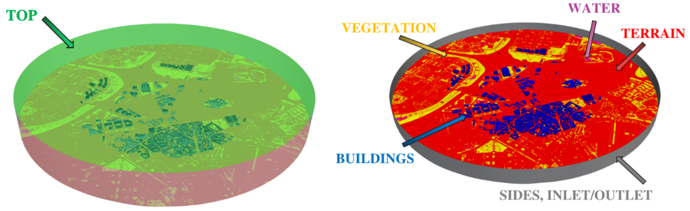
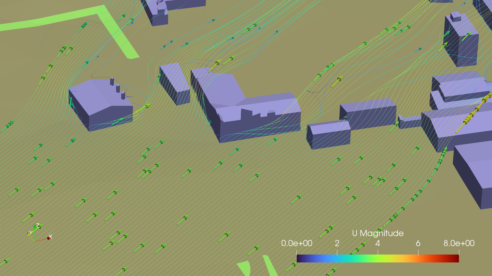
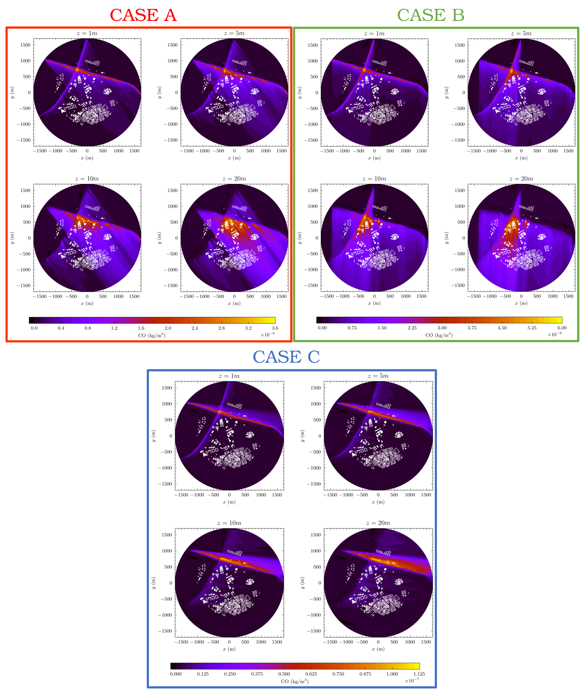

***Main projects funding this research:***

The MODELAIR project has received funding from the European Union’s Horizon Europe research and innovation programme under the Marie Sklodowska-Curie grant agreement No. 101072559. The results of this publication reflect only the author(s) view and do not necessarily reflect those of the European Union. The European Union can not be held responsible for them. The authors gratefully acknowledge the Universidad Politécnica de Madrid [Universidad Politécnica de Madrid](https://www.upm.es/) for providing computing resources on Magerit Supercomputer.

# Computational Fluid Dynamics assessment of Urban Air Quality

Urban environments remains one of the most critical environmental and public health challenges worldwide. Rapid urbanisation, increasing traffic density, and high energy demand have intensified pollutant emissions, creating localised areas of poor air quality that threaten both human health and urban sustainability. The complex interaction between urban form, meteorological conditions, and emission sources makes understanding pollutant dispersion in cities particularly challenging. 
Within the urban canopy, the airflow is highly turbulent and strongly influenced by the geometry of buildings and streets. These interactions give rise to vortical structures and recirculation zones that can trap pollutants and generate persistent hot spots of contamination. Understanding these flow patterns and how they vary with urban topology and pollutant release sources is essential to improving predictive models and to defining targeted mitigation strategies.

# Urban Air Quality CFD simulation - Vallecas District, Madrid

Computational Fluid Dynamics (CFD) simulations provide crucial insights into traffic pollution dispersion across Madrid's urban landscape. By resolving street-level flow structures, including recirculation zones, canyon vortices, and stagnation areas—these simulations identify pollution hotspots that threaten public health in densely populated areas. The results directly inform evidence-based decisions for traffic regulation, traffic light re-timing, and urban planning interventions where emission sources and vulnerable populations (residents, students, pedestrians) are in close proximity.

These baseline simulations establish a foundation for evaluating both passive mitigation strategies (vegetation corridors, urban design modifications) and active control measures (traffic management, operational changes), enabling the municipal authority to target interventions where and when they will be most effective.

## Technical Methodology Overview

### Geometry Generation
Urban geometry was created using [city4CFD](https://github.com/tudelft3d/City4CFD), an open-source tool that integrates polygons footprints datasets and point clouds from the Madrid city council ([geoportal](https://geoportal.madrid.es/IDEAM_WBGEOPORTAL/index.iam)) to generate CFD-ready 3D models. The detailed geometry captures buildings, vegetation, water zones, and critical street-canyon configurations across the Vallecas district, with the computational domain sized following Blocken (2015) guidelines: 15× maximum building height (=1705m) horizontally and 6-7× vertically (=390m).

### Computational Mesh
A **polyhedral mesh with ~90 million cells** was generated using **snappyHexMesh** in [OpenFOAM](https://openfoam.org/version/8/) (v8). The hexahedral-dominant structure includes refined regions near surfaces and additional boundary layer cells to accurately resolve near-wall flow behavior and capture complex urban geometry details.

### Numerical Methods & Solver
**Steady-State Flow Modeling**  
The flow field is computed using OpenFOAM’s *simpleFoam* solver, which is dedicated to steady-state incompressible flows. It relies on the SIMPLE (Semi-Implicit Method for Pressure-Linked Equations) algorithm to iteratively couple pressure and velocity, ensuring mass conservation while solving the momentum equations. A second-order linear upwind scheme is used for advection terms, offering a good compromise between numerical accuracy and stability when resolving velocity gradients and recirculation zones.

**Turbulence Modeling (RANS k–ε)**  
Turbulence is modeled using the steady RANS k–ε approach, which solves for turbulent kinetic energy (k) and its dissipation rate (ε). It is chosen here for this **large-scale urban flows** because it is **computationally efficient** while still capturing key effects like recirculation, shear layers, and enhanced mixing, which is suitable for simulating wind and pollutant dispersion across complex city geometries.

**Turbulent Passive Scalar Transport (Pollution Modeling)**  
Pollutant dispersion is modeled as a passive scalar transport problem, where the concentration field is advected by the mean flow and diffused by both molecular and turbulent mixing. Turbulent diffusion is represented using the gradient-diffusion hypothesis, with the turbulent diffusivity linked to the RANS eddy viscosity through a turbulent Schmidt number of 0.7. This ensures that pollutants respond consistently to the turbulent flow structures predicted by the k–ε model.

### Atmospheric Boundary Layer (ABL) Conditions
A **neutrally stratified atmospheric boundary layer** profile was implemented using **atmBoundaryLayerInletVelocity** conditions, prescribing a logarithmic velocity profile at inlet, outlet, and top boundaries. This recreates fully developed boundary-layer inflow consistent with urban atmospheric conditions.

Surface roughness values were differentiated by terrain type. Turbulent kinetic energy at boundaries follows standard equilibrium boundary-layer relationships ensuring consistency with the logarithmic velocity profile.

### Wall Functions & Boundary Conditions
**No-slip boundary conditions** (u=0) were applied on all solid surfaces (buildings, terrain, vegetation, water), generating realistic shear layers, recirculation zones, and street-canyon vortices.

For pressure, solid surfaces received **zero-gradient conditions** (∂p/∂n=0), while lateral and top boundaries used **freestreamPressure** conditions that automatically switch between fixed values during inflow and zero-gradient during outflow.

Near-wall turbulence was handled with **kqRWallFunction**, ensuring proper dissipation behavior and compatibility with wall-function RANS modeling.

### Meteorological Input Data
Atmospheric data (wind speed and direction at 10m reference height) was sourced from the nearest meteorological monitoring station (from [geoportal](https://geoportal.madrid.es/IDEAM_WBGEOPORTAL/index.iam)). **24 hourly simulations** were performed for the most polluted day of 2024, capturing diurnal evolution of meteorology and traffic emissions under worst-case air quality conditions.

Traffic emissions were calculated using [COPERT values](https://copert.emisia.com/) with emission factors based on hourly traffic flow, speed data from Madrid City Council sensors (A-6) and estimated values (M-40), and vehicle fleet composition for the zone. 

## Flow & Pollutant Field Analysis

### Flow Field Characteristics
The simulations revealed characteristic urban atmospheric boundary layer features:
- Wind speed increases with height due to reduced ground friction
- Buildings generate flow separation, recirculation zones, and enhanced turbulence
- Horseshoe and arch vortices form at building edges, creating stagnation regions with low velocities
- Street canyons aligned with wind act as preferential channels (Venturi effect), while perpendicular streets show weak channeling and dominant recirculation
- Dense building clusters produce successive wake interactions, reducing ventilation efficiency and creating persistent low-velocity pockets

### Pollutant Dispersion Patterns

**Wind direction plays a critical role** in pollutant transport: perpendicular winds on dense blocks generate strong recirculation and reduced ventilation, while aligned winds facilitate faster transport and vertical dilution. Three representative evening hours (17:00-19:00) during peak traffic were analyzed (here, on CO fields):

**Case A (17:00, SE wind):** Pollutant plumes show rapid initial vertical spreading, then strong trapping in building clusters. Multiple recirculation zones cause accumulation and pollutant streaks at higher elevations, with concentration levels up to 1.5× higher than open areas.

**Case B (18:00, S wind):** Enhanced accumulation in neighborhoods with hotspots forming in low-ventilation cavities. Increased stagnation keeps plumes closer to ground level for longer distances.

**Case C (19:00, E wind):** A-6 plumes disperse more efficiently due to open upwind geometry, while M-40 plumes encounter denser urban layouts, resulting in slower dilution and longer residence times.

**Key Finding:** Urban geometry, more than emission intensity, controls pollutant exposure at neighborhood scale. Recirculation cavities, horseshoe vortices, and wake zones act as pollutant traps, creating highly heterogeneous dispersion patterns that require high-resolution CFD analysis to identify and mitigate.

# CFD Tutorial 

Tutorial and codes are coming soon ...

<!-- LISTS -->
<!-- 1.	
2.	List
3.  This
4.  Way

*   Dot
*   List
*   This
*   Way -->

<!-- REFERENCES
[*Author, A., and Author, A., YYYY. Title of the article. Journal.*](LINK-TO-THE-ARTICLE)

<!-- LINKS -->
<!-- [WORD](LINK) -->

<!-- IMAGES -->
<!--  -->

<!-- VIDEOS -->
<!-- <iframe width="560" height="315" src="LINK-EXTRACTED-FROM-YOUTUBE-CODE" title="YouTube video player" frameborder="0" allow="accelerometer; autoplay; clipboard-write; encrypted-media; gyroscope; picture-in-picture; web-share" referrerpolicy="strict-origin-when-cross-origin" allowfullscreen></iframe>
<video width="640" height="360" controls><source src="https://github.com/modelflows/modelflowsapp/blob/master/assets/vid/YOURVIDEOHERE.mp4?raw=true" type="video/mp4">  -->
